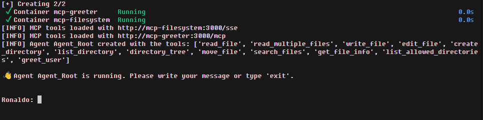

# Agente Conversacional com Google ADK + LiteLLM

Este projeto é um agente conversacional baseado no [Google ADK](https://github.com/google/adk-python) com suporte a LLMs via [LiteLLM](https://github.com/BerriAI/litellm). Ele é configurado para consumir ferramentas (tools) do tipo **MCP** (Model Context Protocol), exclusivamente via **HTTP/SSE**, rodando cada tool em seu próprio contêiner.

## 🎯 Visão Geral

O agente se comunica com servidores MCP expostos em diferentes portas. Cada ferramenta MCP é servida por um contêiner próprio (ex: `mcp-filesystem`, `mcp-greeter`). Todas as ferramentas são acessadas via `MCPToolRegistry` por meio de endpoints definidos em `config_sse_tools.yaml`.

## 📁 Estrutura do Projeto

```
my-agent/
├── app/
│   ├── agent.py
│   └── main.py
├── data/                       # Ponto de montagem para volumes e compartilhamentos entre containers
├── utils/
│   └── tool_registry.py
├── tools/
│   └── mcp-greeter/            # Exemplo de ferramenta personalizada criada com FastAPI e FastApiMCP
│       ├── .env
│       ├── main.py
│       └── Dockerfile          # Container da ferramenta personalizada
├── config_sse_tools.yaml       # Endpoints MCP via HTTP/SSE
├── .env                        # Variáveis de ambiente
├── requirements.txt
├── Dockerfile                  # Container do agente
├── docker-compose.yml          # Orquestração dos containers
└── README.md
```

## ▶️ Como Rodar

### 1. Build

```bash
docker compose build
```

### 2. Interagir com o agente

```bash
docker compose run --rm agente
```

O agente roda em terminal interativo. Você verá o prompt:



Digite sua pergunta ou comando, e o agente responde ou chama uma tool registrada.

---

## 🔧 Configuração

### `.env`

```env
LITELLM_API_KEY=sk-...
LITELLM_MODEL=openai/gpt-4
AGENT_NAME=assistente_mcp
AGENT_INSTRUCTION=Você é um assistente técnico direto e confiável.
AGENT_USER_ID=usuario123
```

---

## 🛰️ MCP Servers no `docker-compose.yml`

### Agente + 2 MCP servers (filesystem + greeter)

```yaml
services:

  agente:
    build: .
    env_file: .env
    volumes:
      - ./tools:/app/tools
    depends_on:
      - mcp-filesystem
      - mcp-greeter
    stdin_open: true
    tty: true

  mcp-filesystem:
    image: node:18
    working_dir: /mcp
    container_name: mcp-filesystem
    volumes:
      - ./data:/mcp
    ports:
      - "3000:3000"
    command: >
      npx -y supergateway \
        --stdio "npx -y @modelcontextprotocol/server-filesystem ." \
        --port 3000 \
        --baseUrl http://0.0.0.0:3000 \
        --ssePath /sse \
        --messagePath /messages

  mcp-greeter:
    build:
      context: ./tools/mcp-greeter
    env_file: ./tools/mcp-greeter/.env
    ports:
      - "3001:3000"
```

---

## 🔧 Exemplo de Tool: `mcp-greeter`

### Estrutura Final

```
tools/mcp-greeter/
├── .env
├── main.py
└── Dockerfile
```

### `.env`
```
GREETER_PORT=3000
```

### `main.py`

```python
import os
from fastapi import FastAPI
from fastapi_mcp import FastApiMCP
from pydantic import BaseModel

PORT = int(os.getenv("GREETER_PORT"))

class GreetRequest(BaseModel):
    name: str

app = FastAPI()

mcp = FastApiMCP(
    app,
    name="Greeter API",
    description="A simple example API using FastAPI and FastApiMCP",
    base_url=f"http://localhost:{PORT}",
    describe_all_responses=True,
    describe_full_response_schema=True
)

@app.post("/greet",  operation_id="greet_user")
async def greet(data: GreetRequest):
    return {"output": f"Hello, {data.name}! **Greetings** from Greeter API!"}

mcp.mount()
mcp.setup_server()
```

### `Dockerfile`

```Dockerfile
FROM python:3.10-slim

WORKDIR /app
COPY . .

RUN pip install --no-cache-dir fastapi uvicorn fastapi-mcp

CMD ["sh", "-c", "uvicorn main:app --host 0.0.0.0 --port ${GREETER_PORT}"]
```

> **Nota:** Esta versão do `greeter` utiliza `fastapi_mcp`, que adiciona suporte nativo a MCP em aplicações FastAPI.

---

## ⚙️ Exemplo: Tool stdio exposta com Supergateway

Uma ferramenta que roda via `stdio` pode ser convertida para o formato HTTP/SSE usando [supergateway](https://github.com/supercorp-ai/supergateway).

### `docker-compose.yml`

```yaml
mcp-filesystem:
  image: node:18
  working_dir: /mcp
  container_name: mcp-filesystem
  volumes:
    - ./data:/mcp
  ports:
    - "3000:3000"
  command: >
    npx -y supergateway \
      --stdio "npx -y @modelcontextprotocol/server-filesystem ." \
      --port 3000 \
      --baseUrl http://0.0.0.0:3000 \
      --ssePath /sse \
      --messagePath /messages
```

### `config_sse_tools.yaml`

```yaml
tools:
  - id: filesystem
    url: http://mcp-filesystem:3000/sse
  - id: greeter
    url: http://mcp-greeter:3001/sse
```

Essa configuração transforma a ferramenta `@modelcontextprotocol/server-filesystem` — que originalmente usa `stdio` — em um servidor HTTP/SSE compatível com ADK via `supergateway`.

---

## 💬 Observações Finais

- Ferramentas MCP são registradas usando `MCPToolset` com `SseServerParams`.
- Atualmente, este agente consome apenas ferramentas MCP expostas via HTTP/SSE.
- O agente é construído via função assíncrona `build_agent()` para carregamento dinâmico.
- Ferramentas podem rodar em contêiner próprio.
- Você também pode encapsular tools stdio com [supergateway](https://github.com/supercorp-ai/supergateway) para expor via HTTP/SSE.

---

## 🧼 Licença
Uso pessoal e experimental. Use com sabedoria e, de preferência, longe de um cluster de produção.